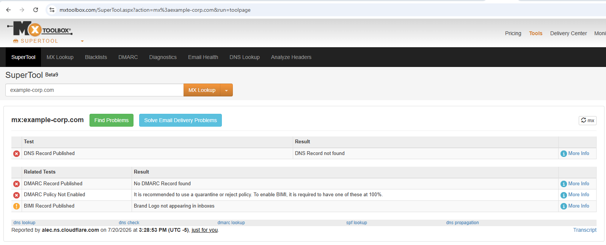
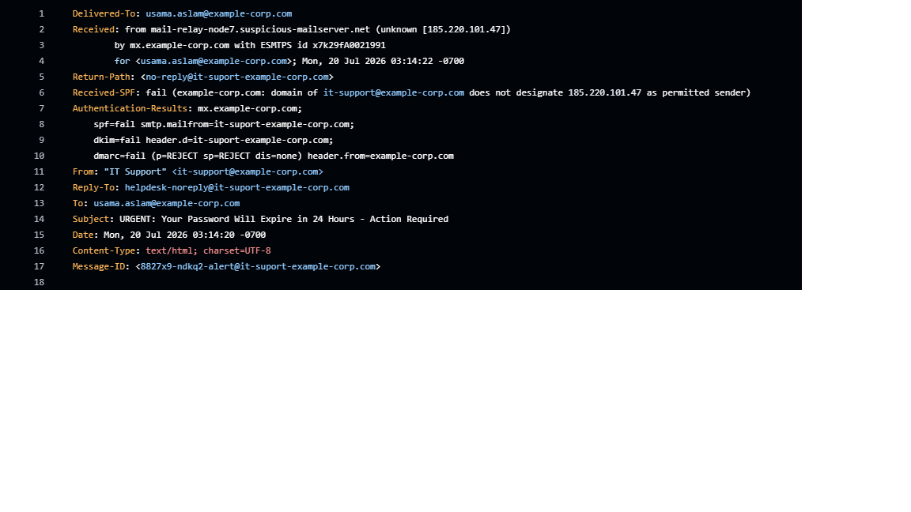
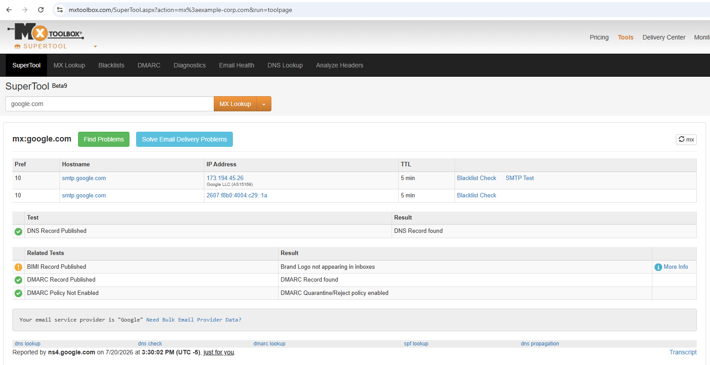
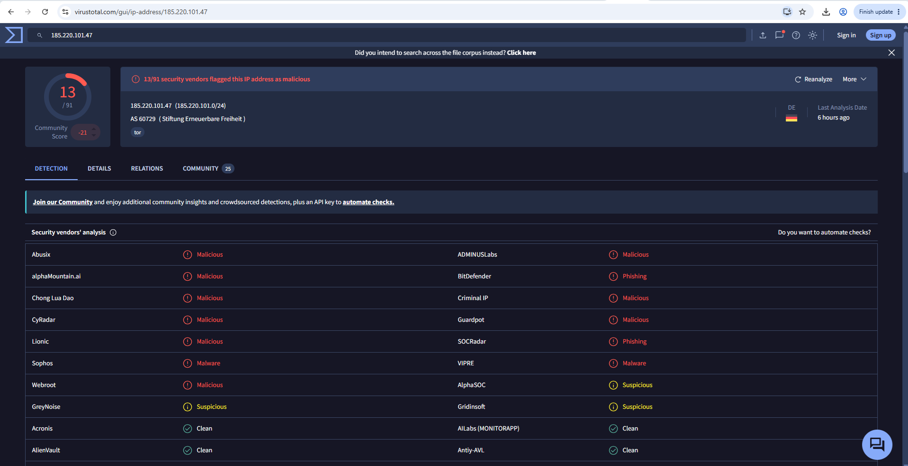

# Phishing Email Analysis Report

## Summary
This report analyzes a self-constructed phishing email impersonating internal IT support, requesting an urgent password reset. Header analysis confirmed sender spoofing and complete authentication failure (SPF, DKIM, and DMARC all failed), consistent with a credential-harvesting phishing attempt.

## Email Overview
| Field | Value |
|-------|-------|
| Claimed sender | it-support@example-corp.com |
| Subject line | URGENT: Your Password Will Expire in 24 Hours - Action Required |
| Date received | Mon, 20 Jul 2026 03:14:20 -0700 |
| Delivered to | usama.aslam@example-corp.com (test inbox) |

## Note on Sample Domain
`example-corp.com` is a fictional domain used for this exercise and does not resolve to real DNS records, confirmed via MXToolbox below.




## Red Flags Identified (Content-Level)
- [x] Urgency/pressure language — subject line and body repeatedly stress a 24-hour deadline and threaten account suspension
- [x] Generic greeting — addressed to "Dear User" rather than the recipient's actual name
- [x] Suspicious/mismatched sender domain — visible "From" address appears legitimate, but Return-Path and Reply-To both point to a misspelled lookalike domain (it-suport-example-corp.com)
- [x] Embedded link with display text differing from actual URL — link text reads "Reset My Password Now" but the underlying URL points to an unrelated domain (verify-account-portal.net)
- [x] Request for credential action framed as urgent/mandatory
- [x] Internally contradictory logic — the email claims both that immediate action is required and that "no action is required," a common inconsistency in hastily constructed phishing templates


## Header Analysis

**Claimed "From" address:** "IT Support" <it-support@example-corp.com> — appears legitimate at first glance, matching the organization's real domain.

**Actual reply/return path:** Both the Return-Path and Reply-To headers point to `it-suport-example-corp.com` — a lookalike domain using a deliberate misspelling ("suport" instead of "support"). The Received header shows the message originated from `mail-relay-node7.suspicious-mailserver.net` (185.220.101.47) — unrelated to the claimed organization's infrastructure.

**Key header fields reviewed:**
```
From: "IT Support" <it-support@example-corp.com>
Return-Path: <no-reply@it-suport-example-corp.com>
Reply-To: helpdesk-noreply@it-suport-example-corp.com
Received: from mail-relay-node7.suspicious-mailserver.net (unknown [185.220.101.47])
```



## Authentication Results (SPF / DKIM / DMARC)

| Check | Result | What It Means |
| ----- | ------ | ------------- |
| SPF | Fail | The sending server (185.220.101.47) was not authorized to send mail on behalf of the claimed domain |
| DKIM | Fail | The email's cryptographic signature did not validate, indicating it was not authentically signed by the claimed domain |
| DMARC | Fail (p=REJECT) | The domain's policy explicitly instructs receiving servers to reject messages failing SPF/DKIM — this email should have been blocked by a properly configured mail server |

**Comparison — a legitimate domain's authentication records** (google.com, checked via MXToolbox) show a valid DNS record, published DMARC record, and enforced quarantine/reject policy — the opposite of this sample's failed results.



## IOC Extraction

| Indicator | Type | VirusTotal Result |
|-----------|------|--------------------|
| example-corp-secure-login.verify-account-portal.net | Domain | 0/91 vendors flagged (Unrated) — fictional domain, no real-world reputation history |
| 185.220.101.47 | Originating IP (from Received header) | **13/91 vendors flagged as malicious**, including specific "Phishing" categorization from BitDefender and SOCRadar. Identified as a known Tor exit node (AS 60729, Stiftung Erneuerbare Freiheit). |

**Note:** While the sender domain was fictional for this exercise, the originating IP address used in the sample's Received header is a real, currently-flagged malicious address associated with phishing activity and Tor exit node infrastructure — reinforcing a realistic detail: attackers frequently route phishing traffic through Tor or other anonymizing infrastructure to obscure their true origin.




## Verdict
**Phishing confirmed.** This email exhibits multiple independent indicators of a credential-harvesting phishing attempt: complete SPF/DKIM/DMARC authentication failure, a spoofed display sender masking a lookalike Return-Path/Reply-To domain, urgency-based social engineering language, a mismatched embedded link, and an originating IP address independently flagged by 13 security vendors as malicious with a specific phishing classification. The convergence of header-level, content-level, and reputation-based evidence provides high confidence this is a phishing attempt.

## Recommendation

- **Block the sender domain** (it-suport-example-corp.com) and originating IP (185.220.101.47) at the email gateway/firewall to prevent delivery of further messages from this source
- **Report and quarantine** the message; alert other users who may have received the same campaign
- **Block the malicious URL domain** at the web proxy/firewall to prevent access even if a user clicks the link
- **User awareness reminder** — this sample is a good candidate for a phishing simulation exercise, since it demonstrates a realistic urgency-based credential-harvesting attempt
- **Verify DMARC enforcement** is properly configured on the legitimate domain (example-corp.com) to ensure spoofed messages using that display name are rejected before reaching inboxes
  
## MITRE ATT&CK Mapping
**T1566.002 — Spearphishing Link**
